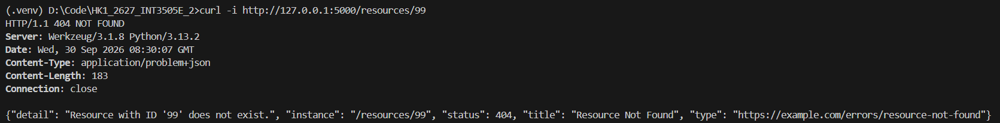
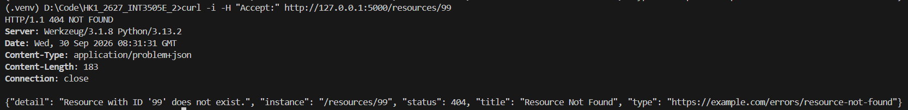
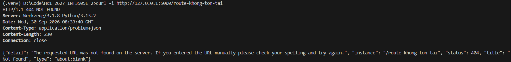
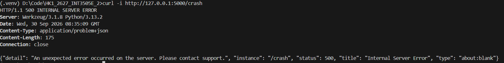
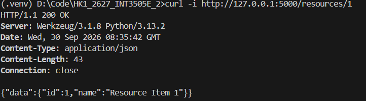

## 1. Test lỗi 404 có chủ đích
Kiểm tra request tới tài nguyên không tồn tại, trả về HTTP status 404 cùng Content-Type application/problem+json

## 2. Test khi client không gửi header Accept
Đảm bảo API trả về mã lỗi kèm application/problem+json ngay cả khi không có header Accept

## 3. Test fallback 404 của Flask (HTTPException)
Kiểm tra truy cập một URL hoàn toàn không tồn tại trong hệ thống router để xem handler fallback có đóng gói thành problem+json hay không

## 4. Test lỗi chưa bắt 500 (Unhandled Exception)
Kiểm tra endpoint bị crash để xác nhận client chỉ nhận được thông điệp trung tính, mã 500 chuẩn problem+json, không lộ stack trac

## 5. Test trường hợp thành công (200 OK)

